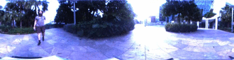
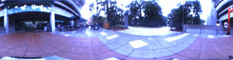
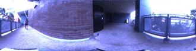
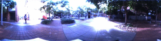

Training behavior policies with odel-free reinforcement learning algorithms currently require a larges amount of interaction with the environment of the agent in order to reach competence at challenging tasks, often far more interaction than would be practical on a real robot in real time. In addition, photorealistic simulations of specific environments can be hard to come by. For these reasons, we propose learning as much as possible directly from real recorded data.

This project page presents the code and data required to reproduce the results from "Learning Deployable Navigation Policies at Kilometer Scale from a Single Traversal", and apply the approach to other datasets and robots.

