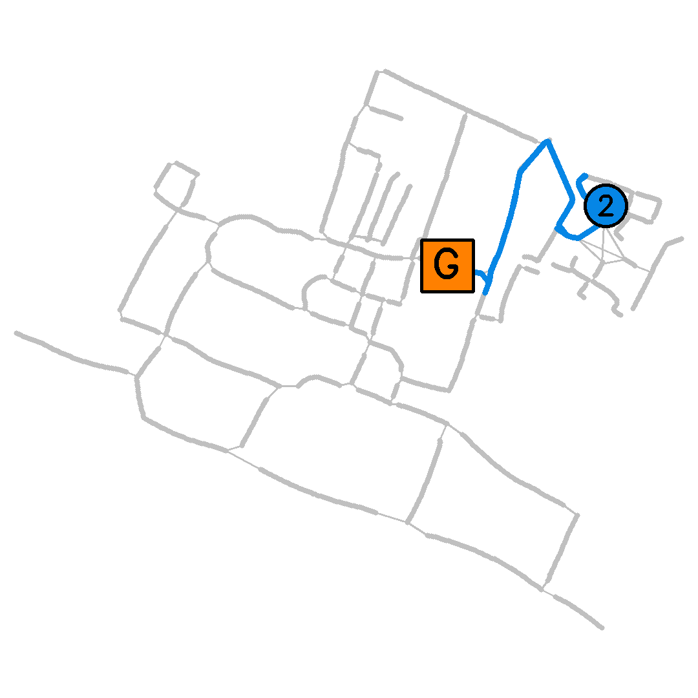

Training behavior policies with model-free reinforcement learning algorithms currently requires a very large amount of agent interaction in order to solve challenging tasks, often far more interaction than would be practical on a real robot in real time. In addition, photorealistic simulations of specific environments can be hard to come by. For these reasons, we propose learning as much as possible directly from real recorded data.

This project page presents the code and data required to reproduce the results from "Learning Deployable Navigation Policies at Kilometer Scale from a Single Traversal", and apply the approach to other datasets and robots.

### Entire Dataset ###

This animation shows one frame for each of the 2099 discrete locations in the dataset.

### Experiment Videos ###

The following animations show one in every 60 frames of the deployment trajectories. This equates to approximately one frame per meter at maximum driving speed.

#### Trajectory 1 (successful) ####

#### Trajectory 2 (successful) ####

#### Trajectory 3 (successful) ####

#### Trajectory 4 (successful) ####

#### Trajectory 5 (successful) ####

#### Trajectory 6 (failed) ####

#### Trajectory 7 (successful) ####

#### Trajectory 8 (successful) ####

#### Trajectory 9 (successful) ####

#### Trajectory 10 (successful) ####

#### Trajectory 11 (successful) ####

